# Calm Cosmic Minimalism — Focus Timer UI Redesign

## Overview

Transform the existing retro arcade spaceship timer into a **calm sci-fi minimal focus timer**. The goal is ambient productivity UI — polished, spacious, readable, atmospheric — not bare Apple minimalism, but not cluttered retro either. Keep the cosmic personality while dramatically reducing visual noise.

**Tagline microcopy:** *"One task. One orbit."*

---

## Current vs Target

```
CURRENT                              TARGET
─────────────────────────────────    ─────────────────────────────────
Retro arcade pixel-art aesthetic     Calm cosmic minimalism
92 stars + comet + nebula blobs      ~30 stars, no comet, softer nebula
Bright cyan/yellow accents           Soft cyan + muted purple/gold
Bold 1.2px borders with glow         0.5-0.8px borders, minimal glow
Square progress blocks               Tiny orbit dots + faint line
WORK/BREAK mode labels               Focus/Rest text tabs + underline
Retro pill button with icon+text     Large translucent pill, soft border
38px header buttons with borders     32px ghost buttons, no borders
```

---

## Architecture — Files to Modify

No new files needed. All changes are in-place modifications to existing widgets. The domain layer (`TimerState`, `TimerController`, `TimerConfig`, `TimerStatus`) is **untouched** — this is purely a presentation-layer redesign.

```mermaid
graph TD
    A[SpaceshipTimerScreen] --> B[SpaceViewport]
    A --> C[retro_timer_widgets]
    A --> D[_RetroHeaderButton]
    A --> E[_AtmosphereOrb]
    B --> F[SpaceScenePainter]
    F --> G[star_painter]
    F --> H[planet_painter]
    F --> I[ship_painter]
    F --> J[SpacePalette]
    C --> K[RetroTimerField]
    C --> L[RetroPomodoroSetProgress]
    C --> M[RetroModeLabel]
    C --> N[RetroPlayButton]
    C --> O[RetroFireworks]

    style A fill:#1a2744,stroke:#4dd9e8,stroke-width:1
    style J fill:#1a2744,stroke:#4dd9e8,stroke-width:1
    style K fill:#1a2744,stroke:#c9a0dc,stroke-width:1
    style L fill:#1a2744,stroke:#c9a0dc,stroke-width:1
    style M fill:#1a2744,stroke:#c9a0dc,stroke-width:1
    style N fill:#1a2744,stroke:#c9a0dc,stroke-width:1
    style G fill:#1a2744,stroke:#c9a0dc,stroke-width:1
    style F fill:#1a2744,stroke:#c9a0dc,stroke-width:1
    style B fill:#1a2744,stroke:#c9a0dc,stroke-width:1
    style D fill:#1a2744,stroke:#c9a0dc,stroke-width:1
```



---

## Screen Layout — Vertical Composition

```
┌─────────────────────────────────────┐
│  SafeArea top                       │
│                                     │
│  ┌─ header ──────────────────────┐  │
│  │  [stats] [feedback]    (ghost)│  │  ← smaller/lighter icons
│  └───────────────────────────────┘  │
│                                     │
│  ┌─ starfield card ──────────────┐  │
│  │                               │  │
│  │   ✦  ·    ·        ✦         │  │  ← fewer stars, softer border
│  │      ·  🚀    ·              │  │
│  │   ·       ·    ·    ·        │  │
│  │              🪐               │  │
│  └───────────────────────────────┘  │
│                                     │
│     One task. One orbit.            │  ← subtle microcopy
│                                     │
│          25:00                       │  ← large, borderless, dominant
│                                     │
│     ○───○───●───○                   │  ← orbit dot progress
│                                     │
│     Focus    Rest                   │  ← text tabs + underline
│     ─────                           │
│                                     │
│  ┌─────────────────────────────┐    │
│  │   ▶  Start Focus            │    │  ← translucent pill button
│  └─────────────────────────────┘    │
│                                     │
│         ━━━━━━━━━━                  │  ← home indicator
└─────────────────────────────────────┘
```

---

## Detailed Changes by File

### 1. `space_palette.dart` — Color Token Update

**What:** Add new calm-cosmic color tokens alongside existing ones. The existing pixel-art colors for ship/planet/exhaust stay unchanged since those are used by the scene painter internals.

**New tokens to add:**

| Token | Hex | Purpose |
|-------|-----|---------|
| `calmCyan` | `#4DD9E8` | Primary accent — timer, active states |
| `calmGold` | `#C9A87C` | Muted gold — break accent, secondary |
| `calmPurple` | `#8B7CB8` | Muted purple — decorative details |
| `textPrimary` | `#E8E8F4` | Main text — timer digits |
| `textMuted` | `#6B7394` | Secondary text — labels, inactive |
| `surfaceDark` | `#0A1628` | Card/button fill |
| `borderSubtle` | opacity-based | Derived from accent at 0.15-0.20 |

**Reduce `px` from 3.0 to 2.5** — makes pixel-art slightly finer/calmer.

---

### 2. `star_painter.dart` — Reduce Starfield Density

**What:** Cut star count from 92 to ~35. Remove the pixel comet entirely. Reduce cross-hair decorations.

**Changes:**
- Loop count: `92` → `35`
- Remove `_drawPixelComet` call and function
- Remove the cross-hair `if (!dimmed && i % 29 == 0)` block
- Reduce bright star frequency: `i % 5 == 0` → `i % 7 == 0`
- Lower base alpha: `0.42 + twinkle * 0.34` → `0.28 + twinkle * 0.20`
- Use smaller star rectangles: bright `px * 0.85` → `px * 0.65`, dim `px * 0.42` → `px * 0.35`

---

### 3. `space_scene_painter.dart` — Soften Scene Visuals

**What:** Reduce nebula blob opacity, reduce grid line count, soften overall atmosphere.

**Changes:**
- Nebula blob opacities: reduce all by ~40%
  - Purple: `pulse * 0.2` → `pulse * 0.10`
  - Magenta: `pulse * 0.14` → `pulse * 0.07`
  - Blue: `pulse * 0.1` → `pulse * 0.05`
- Grid lines: increase spacing from `px * 8` to `px * 16` (half the lines)
- Grid line opacity: `0.08` → `0.04`
- Grid stroke width: `1` → `0.5`

---

### 4. `space_viewport.dart` — Soften Card Border

**What:** Make the starfield card border softer and less prominent.

**Changes:**
- Border width: `1.2` → `0.6`
- Border color alpha: `0.22` → `0.12`
- Box shadow blur: `24` → `16`
- Box shadow alpha: `0.10` → `0.06`
- Border radius: `24` → `20` (slightly tighter, more modern)
- Inner gradient: keep but reduce `spaceBgAlt` alpha from `0.72` → `0.50`

---

### 5. `retro_timer_widgets.dart` — Major Widget Redesigns

#### 5a. `RetroTimerField` — Large Borderless Timer

**What:** Make the timer the dominant visual element. Larger, cleaner, no decorative shadow.

**Changes:**
- Font size: `76` → `84`
- Font weight: `w800` → `w300` (thin, elegant)
- Letter spacing: `3` → `6` (more breathable)
- Shadow blur when running: `18` → `8`
- Shadow alpha when running: `0.20` → `0.08`
- Shadow alpha when idle: `0.10` → `0.04`
- Use `SpacePalette.textPrimary` as base color, tinted by accent
- Color approach: `Color.lerp(SpacePalette.textPrimary, accentColor, 0.35)`

#### 5b. `RetroPomodoroSetProgress` → `OrbitDotProgress`

**What:** Replace square progress blocks with tiny orbit dots connected by a faint line.

**New design:**
- A horizontal `CustomPaint` widget
- Draws a faint connecting line (`0.5px`, accent at `0.10` opacity)
- Draws 4 small circles (`radius: 3.5px`)
  - Completed: filled with planet gradient colors, alpha `0.65`
  - Active (current): slightly brighter, alpha `0.85`, subtle `2px` glow
  - Empty: stroke-only, accent at `0.20` opacity, `0.5px` stroke
- Total width: ~120px, dots spaced ~30px apart
- Remove `_RetroProgressSquare` class entirely

#### 5c. `RetroModeLabel` → Focus/Rest Tabs with Underline

**What:** Replace the two separate animated labels with a minimal segmented text-tab control.

**New design:**
- `Row` of two `GestureDetector` text items
- Active tab: `SpacePalette.textPrimary` color, `w600` weight
- Inactive tab: `SpacePalette.textMuted` color, `w400` weight
- Active tab has an `AnimatedContainer` underline below it:
  - Width: text width + 8px padding
  - Height: `1.5px`
  - Color: current accent at `0.50` opacity
  - Border radius: `1px`
- Font size: `13`
- Letter spacing: `2`
- Spacing between tabs: `28px`
- The whole control should be tappable but only visually indicate state (no manual switching — state is driven by timer)

#### 5d. `RetroPlayButton` — Large Translucent Pill

**What:** Redesign as a spacious, calm pill button.

**Changes:**
- Height: `58` → `56`
- Horizontal padding: `24` → `36` (wider pill)
- Background: `color.withAlpha(0.14)` → `SpacePalette.surfaceDark.withAlpha(0.60)` (translucent dark fill)
- Border width: `1.2` → `0.8`
- Border color: accent at `0.30` opacity (softer)
- Border radius: `24` → `28` (rounder pill)
- Box shadow blur: `22` → `10`
- Box shadow alpha: `0.16` → `0.06` (very restrained glow)
- Icon size: `24` → `20`
- Text font size: `14` → `13`
- Text font weight: `w800` → `w600`
- Text letter spacing: `1.1` → `1.5`

#### 5e. `RetroFireworks` — Keep but Soften

**Changes:**
- Reduce particle alpha multiplier: `0.72` → `0.45`
- Reduce white center alpha: `0.55` → `0.30`
- Particle size: `5` → `4`

#### 5f. `RetroLabel` — Soften Top Label

**Changes:**
- Font size: `13` → `12`
- Font weight: `w900` → `w600`
- Letter spacing: `4` → `3`
- Use `SpacePalette.textMuted` blended with accent: `Color.lerp(textMuted, accent, 0.4)`

---

### 6. `spaceship_timer_screen.dart` — Layout & Composition

**What:** Update the main screen layout for spacious calm composition.

#### 6a. Color Constants Update
- `_cyan` → use `SpacePalette.calmCyan`
- `_yellow` → use `SpacePalette.calmGold`
- `_muted` → use `SpacePalette.textMuted`
- `_textLight` → use `SpacePalette.textPrimary`

#### 6b. Background Gradient
- Keep 3-stop gradient but shift toward deeper navy/indigo:
  - Stop 0: `#070E22` (deeper navy)
  - Stop 1: `#0B1530` (dark indigo)
  - Stop 2: `#12103A` (muted deep purple)

#### 6c. Atmosphere Orbs
- Reduce cyan orb alpha: `0.12` → `0.06`
- Reduce muted orb alpha: `0.18` → `0.08`
- Reduce sizes: `260` → `220`, `300` → `240`

#### 6d. Header Buttons (`_RetroHeaderButton`)
- Size: `38x38` → `32x32`
- Remove `border` entirely
- Remove `boxShadow` entirely
- Background: `_panel.withAlpha(0.58)` → `Colors.transparent`
- Icon size: `19` → `16`
- Icon color alpha: full → `0.45`
- Border radius: `18` → `16`

#### 6e. Layout Flex Ratios
- Starfield card area: `flex: 5` → `flex: 4` (slightly less dominant)
- Timer + progress area: `flex: 4` → `flex: 5` (more room for timer)
- This shifts visual weight toward the timer as the primary element

#### 6f. Microcopy
- Keep "One task. One orbit." text
- Reduce opacity: `0.70` → `0.40`
- Font size: `13` → `12`
- Font weight: `w500` → `w400`

#### 6g. Bottom Spacing
- Button bottom padding: `32` → `36`
- Home indicator bar: keep as-is, reduce opacity from `0.15` → `0.10`

#### 6h. Dialog Styling (`_RetroInfoDialog`, `_RetroStatRow`, `_RetroDialogButton`)
- Border width: `1.2` → `0.8`
- Border alpha: `0.34` → `0.20`
- Shadow blur: `28` → `14`
- Shadow alpha: `0.14` → `0.06`
- Use new palette tokens for colors

---

## Visual Design Tokens Summary

```
Background gradient:    #070E22 → #0B1530 → #12103A
Card surface:           #0A1628 at 50-60% opacity
Primary accent:         #4DD9E8 (calm cyan)
Break accent:           #C9A87C (muted gold)
Decorative:             #8B7CB8 (muted purple)
Text primary:           #E8E8F4
Text muted:             #6B7394
Border opacity:         0.12 - 0.20
Glow opacity:           0.04 - 0.08
Star count:             ~35 (down from 92)
Grid lines:             half density, 0.04 opacity
Border widths:          0.5 - 0.8px
```

---

## What Stays Unchanged

- **Domain layer**: `TimerState`, `TimerStatus`, `TimerController`, `TimerConfig` — zero changes
- **Ship painter**: pixel-art ship stays the same (it is small and charming)
- **Planet painter**: procedural planets stay the same (they are the cosmic personality)
- **Duration picker**: the bottom sheet picker is a separate flow, not part of this redesign
- **Session runtime / statistics store**: application layer untouched
- **Navigation**: `HomeScreen` → `SpaceshipTimerScreen` routing unchanged

---

## Implementation Order

The changes should be applied in this sequence to avoid breaking intermediate states:

1. **`space_palette.dart`** — add new color tokens first (everything depends on these)
2. **`star_painter.dart`** — reduce star count and remove comet
3. **`space_scene_painter.dart`** — soften nebula and grid
4. **`space_viewport.dart`** — soften card border
5. **`retro_timer_widgets.dart`** — redesign all widgets (timer, progress, tabs, button)
6. **`spaceship_timer_screen.dart`** — update layout, colors, header buttons, dialogs

Each step produces a compilable, runnable app. No step depends on a later step.
