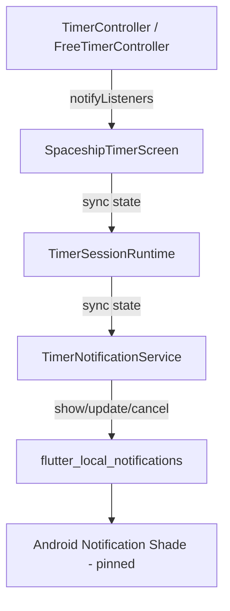
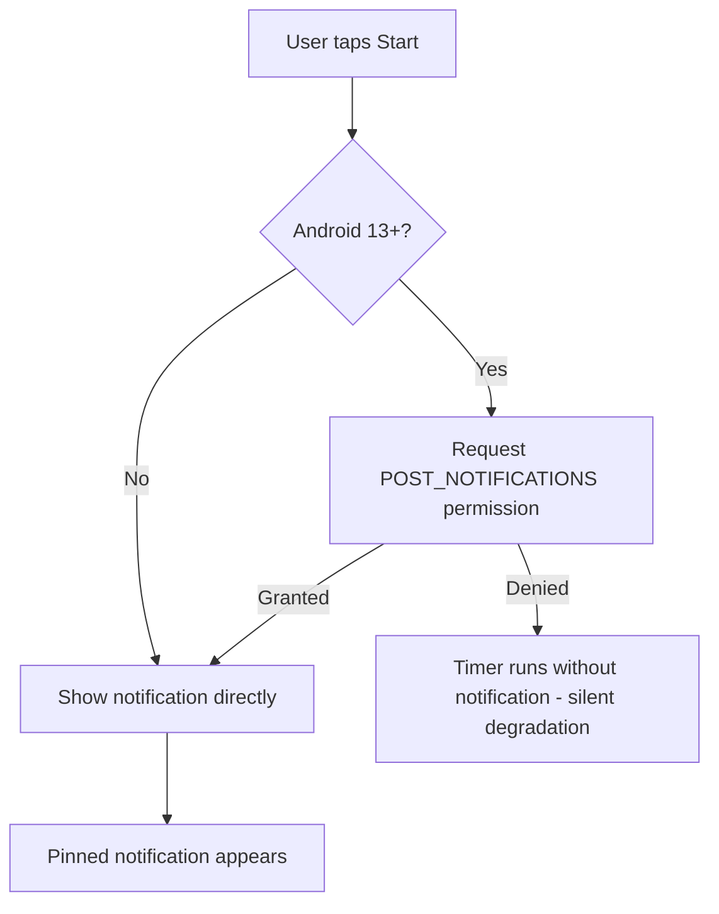

# Pinned Timer Notification — Architectural Plan

## Goal

When the user starts **either** the Pomodoro timer or the free Timer, show a **pinned (ongoing) Android notification** that:

- Displays a space-themed phrase: **"Sailing through the galaxy... 🚀"**
- Shows a live countdown synced with the in-app timer (updated every second)
- Indicates the current mode (Focus / Rest / Timer)
- Changes to a completion message when the timer finishes
- Disappears when the timer is reset or idle

## Constraints

| Constraint | Decision |
|---|---|
| Target platform | **Android only** (no-op on iOS/desktop) |
| F-Droid compatible | **Yes** — no Firebase/GMS dependencies |
| Package | `flutter_local_notifications` (FOSS, no GMS) |
| File size rule | Each file ≤ 100 lines (per `ai.md`) |

---

## Architecture



### Key Design Decisions

1. **`TimerNotificationService`** — a new standalone service class that wraps `flutter_local_notifications`. It exposes three methods:
   - `show(mode, remainingSeconds)` — creates or updates the pinned notification
   - `showComplete(mode)` — switches notification text to completion message
   - `cancel()` — removes the notification

2. **Integration point** — [`TimerSessionRuntime`](lib/features/timer/application/timer_session_runtime.dart) already acts as the bridge between timer state and platform behavior (wakelock). We extend it to also drive the notification service. This keeps the screen widget thin.

3. **No foreground service** — We use a standard ongoing notification (`ongoing: true`, `autoCancel: false`). The timer countdown is driven by the existing `Timer.periodic` in the controllers. A foreground service is **not** needed because:
   - The wakelock keeps the process alive while the screen is on
   - Android keeps the app process alive for a reasonable time in the background
   - If the OS kills the app, the notification disappears naturally (acceptable UX)
   - Avoids complex native code and keeps F-Droid simplicity

4. **Chronometer vs manual update** — Android notifications support a built-in `chronometer` that counts up/down natively. However, `flutter_local_notifications` has limited chronometer support. Instead, we update the notification text every second from the existing tick callback. This is reliable and gives us full control over formatting.

---

## New / Modified Files

### New Files

| File | Purpose | Lines |
|---|---|---|
| `lib/features/timer/application/timer_notification_service.dart` | Wraps `flutter_local_notifications`, exposes `show`/`showComplete`/`cancel` | ~80 |
| `lib/features/timer/application/timer_notification_config.dart` | Notification channel ID, name, phrases, completion messages | ~30 |

### Modified Files

| File | Change |
|---|---|
| `pubspec.yaml` | Add `flutter_local_notifications: ^19.0.0` dependency |
| `android/app/src/main/AndroidManifest.xml` | Add `POST_NOTIFICATIONS` permission |
| `lib/features/timer/application/timer_session_runtime.dart` | Create and drive `TimerNotificationService` on sync |
| `lib/features/timer/presentation/spaceship_timer_screen.dart` | Pass mode info to `TimerSessionRuntime.sync()` |
| `lib/main.dart` | Initialize notification plugin before `runApp` |

---

## Detailed File Designs

### `timer_notification_config.dart`

```dart
/// Android notification channel and content constants.
abstract final class TimerNotificationConfig {
  static const String channelId = 'timer_countdown';
  static const String channelName = 'Timer Countdown';
  static const String channelDescription = 'Shows countdown while timer is active';
  static const int notificationId = 1;

  static const String activePhrase = 'Sailing through the galaxy... 🚀';
  static const String focusCompletePhrase = 'Focus complete! 🌕';
  static const String restCompletePhrase = 'Rest complete! ⭐';
  static const String timerCompletePhrase = 'Timer complete! 🪐';
}
```

### `timer_notification_service.dart`

```dart
class TimerNotificationService {
  FlutterLocalNotificationsPlugin? _plugin;
  bool _initialized = false;

  Future<void> initialize();
  Future<bool> requestPermission();
  Future<void> show({required String mode, required String timeLabel});
  Future<void> showComplete({required String message});
  Future<void> cancel();
}
```

- `initialize()` — creates the plugin instance, sets up the Android notification channel with low importance (no sound/vibration, just visual)
- `show()` — title = mode label (e.g. "Focus"), body = "Sailing through the galaxy... 🚀 — 24:31", ongoing = true
- `showComplete()` — title = "To The Moon Timer", body = completion phrase, ongoing = false (user can swipe away)
- `cancel()` — cancels notification by ID
- Platform guard: all methods are no-ops on non-Android platforms via `Platform.isAndroid` check

### `timer_session_runtime.dart` changes

The existing [`sync(TimerState)`](lib/features/timer/application/timer_session_runtime.dart:15) method signature changes to accept a unified info object:

```dart
Future<void> sync({
  required bool isPlaying,
  required bool isComplete,
  required String modeLabel,       // "Focus" / "Rest" / "Timer"
  required String timeLabel,       // "24:31" or "1:24:31"
  required String completeMessage, // "Focus complete! 🌕"
}) async { ... }
```

Logic:
- If `isPlaying` → enable wakelock + `_notification.show(mode, timeLabel)`
- If `isComplete` → disable wakelock + `_notification.showComplete(completeMessage)`
- Otherwise → disable wakelock + `_notification.cancel()`

### `spaceship_timer_screen.dart` changes

In [`_onTimerChanged()`](lib/features/timer/presentation/spaceship_timer_screen.dart:137) and [`_onFreeTimerChanged()`](lib/features/timer/presentation/spaceship_timer_screen.dart:164), the call to `_sessionRuntime.sync(timerState)` is updated to pass the new parameters:

```dart
_sessionRuntime.sync(
  isPlaying: timerState.isActivelyPlaying,
  isComplete: timerState.isAwaitingAcknowledgement || timerState.isSetComplete,
  modeLabel: timerState.isOnBreak ? 'Rest' : 'Focus',
  timeLabel: TimerFormatter.format(timerState.remainingSeconds),
  completeMessage: timerState.isAwaitingBreakAcknowledgement
      ? TimerNotificationConfig.focusCompletePhrase
      : TimerNotificationConfig.restCompletePhrase,
);
```

### `main.dart` changes

```dart
void main() async {
  WidgetsFlutterBinding.ensureInitialized();
  // Notification plugin init happens lazily inside TimerNotificationService
  runApp(const PomodoroApp());
}
```

No change needed — the service initializes lazily on first `show()` call.

### `AndroidManifest.xml` changes

```xml
<uses-permission android:name="android.permission.POST_NOTIFICATIONS" />
```

This is needed for Android 13+ (API 33+). The permission is requested at runtime before showing the first notification.

### Permission Flow



---

## Notification Appearance

```
┌─────────────────────────────────────────┐
│ 🚀 Focus                               │
│ Sailing through the galaxy... 🚀 — 24:31│
│                              ongoing    │
└─────────────────────────────────────────┘
```

On completion:
```
┌─────────────────────────────────────────┐
│ 🌕 To The Moon Timer                    │
│ Focus complete!                         │
│                           swipe to dismiss│
└─────────────────────────────────────────┘
```

---

## Risks & Mitigations

| Risk | Mitigation |
|---|---|
| App killed in background → notification stuck | Notification is `ongoing` so Android removes it when process dies. Also, `cancel()` is called in `dispose()`. |
| Updating notification every second causes battery drain | `flutter_local_notifications` updates are lightweight — just a system call to `NotificationManager.notify()`. No new channels or sounds. |
| User denies notification permission | Silent degradation — timer works normally, just no notification. No repeated permission prompts. |
| `flutter_local_notifications` version compatibility | Pin to `^19.0.0` which supports the latest Android APIs and is well-maintained. |
